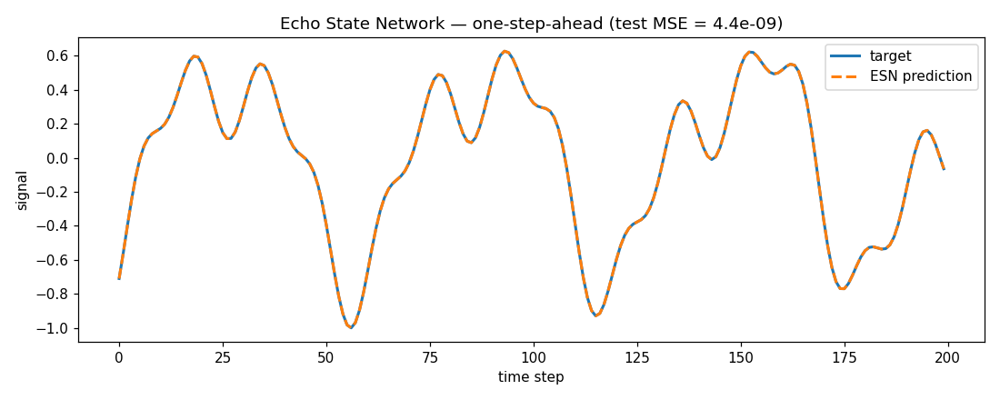

# Echo State Network — minimal demo

A tiny [Echo State Network](https://en.wikipedia.org/wiki/Echo_state_network)
(reservoir computing) in ~60 lines of NumPy. A pool of random recurrent neurons
("the reservoir") is driven by an input signal; **only a linear readout is
trained** (ridge regression), which makes ESNs fast and simple.

## What it does

- Builds a sparse random reservoir, scaled to a spectral radius of `0.95`.
- Drives it with a smooth quasi-periodic signal (a sum of sines).
- Trains a linear readout to predict the **next** value (one-step-ahead).
- Evaluates on held-out steps and plots prediction vs. target.

## The reservoir update

```
x(t+1) = tanh( Win · [1; u(t)] + W · x(t) )
```

where `W` is the recurrent reservoir matrix and `Win` the input weights. Only
the readout `Wout` is learned.

## Run

```bash
pip install numpy matplotlib
python esn.py
```

This prints the test MSE and writes the figure below.

## Result



The dashed prediction tracks the target almost exactly — the reservoir's rich
dynamics make one-step-ahead prediction of this signal easy.

## Next steps

- [ ] Try autonomous generation (feed predictions back as input)
- [ ] Swap in Mackey-Glass as the target
- [ ] Sweep `spectral_radius` and reservoir size
